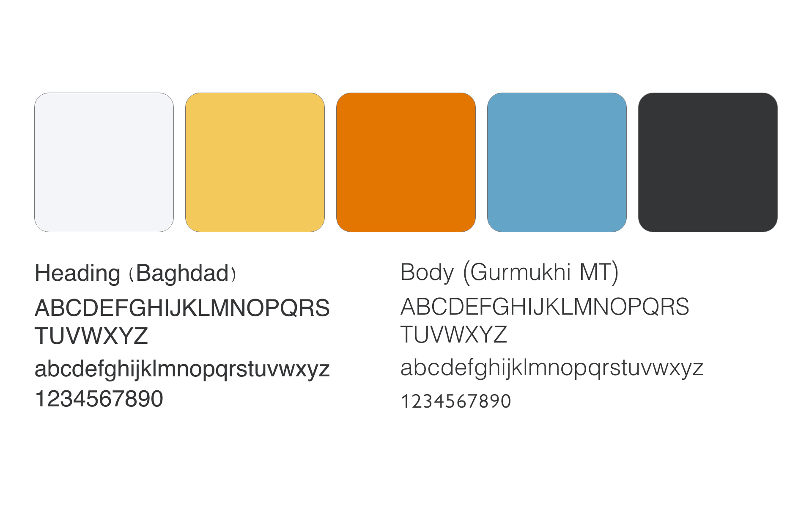
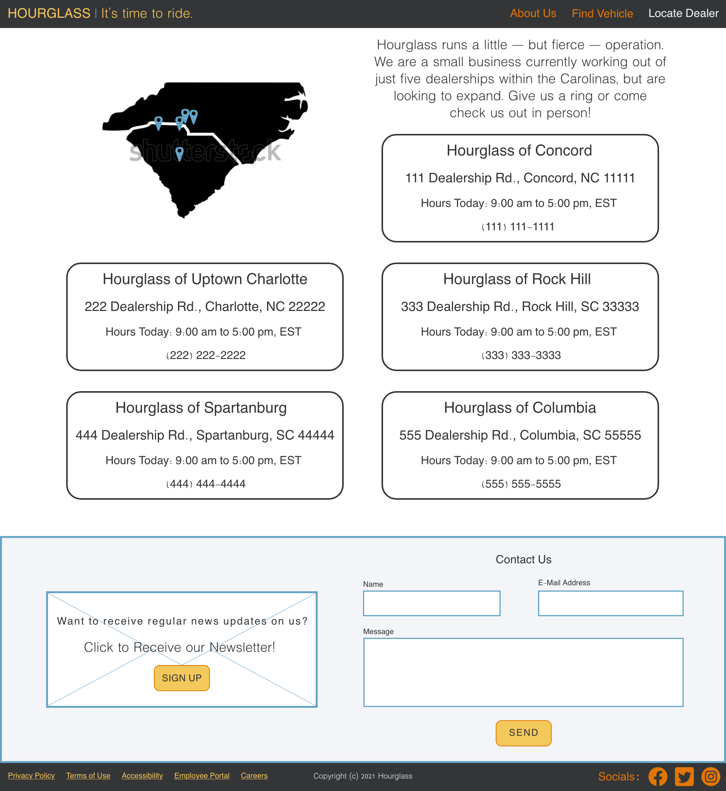
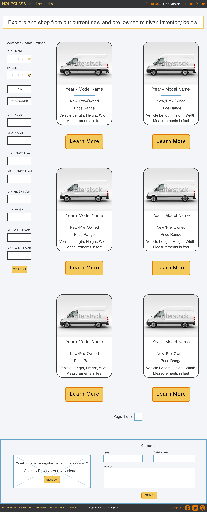
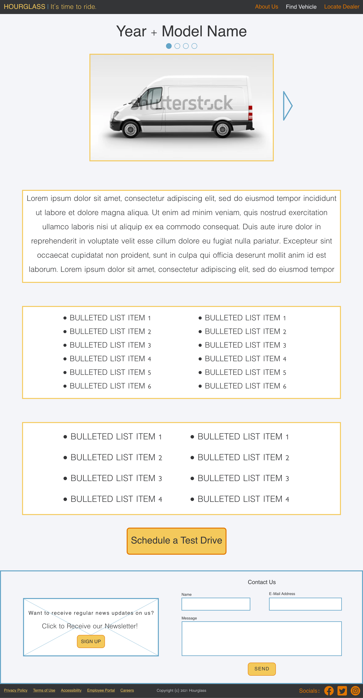
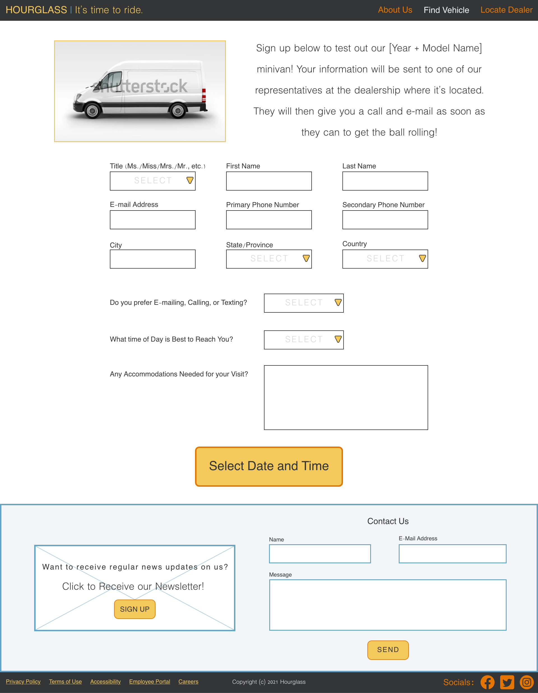

<h1 style="font-size: 20px">HOURGLASS - <i>Minivan Retail Company Website</i> - 2022</h1>

<h2 style="font-size: 18px">PROJECT OVERVIEW</h2>

The following project is a website design concept presentation, based from an auto-generated design brief, for a fictional retail company called Hourglass. They make affordable minivans with an emphasis on design and their target audience is older teens/young adults.

<h2 style="font-size: 18px">THE CHALLENGE</h2>

The inquiry from Hourglass was for a design that conveys an influential brand and feels consistent throughout the prototype. They wanted an informative website that is easy to navigate. The inquiry requested it include About, Shop, and Privacy Policy Pages, with the Landing Page containing a Contact Us section. They wanted a section of the landing page dedicated to convincing users to subscribe to their newsletter. They also wanted a luxurious design that incorporates their brand color, yellow.

<h2 style="font-size: 18px">BRAND GUIDELINES</h2>

  
  

<h2 style="font-size: 18px">THE PROCESS</h2>

Starting out, I reflected on what the client wanted to establish the above brand guidelines to work off of, observing design structures used in real vehicle retailers' websites, and taking into account user experience (UX) design standards. Next came the process of creating the clickable, high-fidelity wireframe prototype (version 1) in Adobe XD. The prototype contains "Lorem Ipsums" taking the place of an actual body of content a real client would have written. Images were sourced from resources such as Unsplash, Pexels, Shutterstock, etc.

Once I made my v. 1 prototype, I uploaded it to a website creators use for finding real volunteers to test their interface designs to gain insights on moving forward with re-designing an improved, finalized project. I commissioned a minimum of 20 testers, male and female, between the ages of 18 to 65, to test the mission of moving from the starting point at the Landing Page, to the ending point at the Schedule Test Drive Page. Testers provided feedback regarding the difficulty level of the mission to schedule a test drive, and gave their opinions on the visual design/layout of the interface's mission critical pages, as well as supplemental pages like the About Us and Locate Dealer pages. Due to the technical limitations of the testing website, users were not able to view non-static elements such as animations/transitions.

From these results, I found that almost all of the testers had a positive impression. When asked on the prototype's strengths, testers mostly commented on its ease of use, intuitiveness, cleanness of design, and logical flow of information. Testers did not offer much in the way of commenting on the prototype's weaknesses, but what I've gathered from those responses, the prototype could stand to be more dynamic and modernized aesthetically.

Commonly written suggestions given by testers included:

<ul>
  <li>Incorporating more color variety</li>
  <li>Decreasing number of vehicle description boxes on each Shop Page</li>
  <li>Reducing amounts of text to de-clutter Shop, About Us, & Privacy Policy Pages</li>
  <li>Improving the map design on Locate Dealer Page</li>
  <li>Changing "Shop" to "Find a Vehicle", as that phrase better fits user flow's end destination</li>
  <li>Improving design of Landing Page's hero box so it's more eye-catching</li>
</ul>

Keeping this feedback in mind, I re-visited my prototype to create an updated version with a renewed perspective.

<h2 style="font-size: 18px">FINALIZED DESIGN</h2>

The following are static .PNG screenshots highlighting the prototype, which is an XD file. XD files are not able to be embedded into GitHub repositories at this time. If you wish to view more high-definition screenshots, please see the accompanying PDFs in this repository. 

<h3 style="font-size: 16px" align="center">LANDING PAGE</h3>

<h3 style="font-size: 16px" align="center">ABOUT PAGE</h3>

<h3 style="font-size: 16px" align="center">LOCATE DEALER PAGE</h3>

<h3 style="font-size: 16px" align="center">SHOP PAGE</h3>

 

Selecting "Learn More" under a vehicle summary leads to the following page. ⬇️

 

 

Selecting "Schedule a Test Drive" under the vehicle's bio leads to the following page. ⬇️

 

